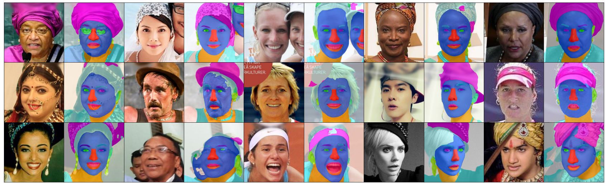

## Explanable Face Recognition


# Dataset Ordanization

## The Dataset Module

To faciliate the experiments, a module was created to handle the datasets. The module is located in the **dataset** folder contains a single code file (*\_\_init__.py*) that expose the utilitary functions and folders to all available datasets, (e.g. **lfw**, **vggface2**).

Usage example:
    
```python
from dataset import DATASET_LFW, DATASET_KIND_RAW, ls_imgs_paths

# List all images paths in the LFW dataset
imgs_paths = ls_imgs_paths(dataset=DATASET_LFW, kind=DATASET_KIND_RAW)
```

When the module is imported by the first time, it will check for available datasets and generates an index file to improve operations in the future uses, if the dataset are changes or updated, the function **get_dataset_index(recreate=True)** shall be executed the regenerate the index file.

# Experiments

## Images Preprocessing

In order to prepare the dataset of images for the experiments, we need to align the faces in the imagens, crop to a squared size and ensure file type.

To accomplish this, the script **run_align.py** can be used. The script uses the **dataset** module to lookup the images and process them. The results are placed in the **aligned_images** folder inside of respective folder of the dataset following the same structure of the **raw** folder (*person_name/imgs*). The following image ilustrates the process result:


Under the hood, the script uses the [DLIB face detector model](http://dlib.net/python/index.html#dlib_pybind11.cnn_face_detection_model_v1) to identify the faces landmarks and align the images. The aligning function was extracted from the [FFHQ Dataset Pre-Processing](https://github.com/NVlabs/ffhq-dataset/blob/master/download_ffhq.py) and transformed into a utilitary function for the project.

## Face Segmentation

Once all the images from dataset are well aligned and with the right sizes, we can advance to the face segmentation step, the face segmentation process will separate all the facial elements of the images (e.g. eyes, nose, mouth, etc.) into different images. The following image ilustrates the process result:



To execute this task, the script **run_segmentation.py** can be used. The script uses the **dataset** module to lookup all the aligned images into the dataset folders and process them. The results are placed in the **segmented_images** folder inside of respective folder of the dataset following the same structure of the **raw** folder (*person_name/imgs*), the segmentation maps are also saved in the **segmentation_maps** folder, under the dataset folder following the same structure.

To execute the face segmentation it is used a pre-trained model from the [BiSeNet](https://arxiv.org/abs/1808.00897) architecture.

Obs.: The BiSeNet model being used is implemented using PyTorch, so it is recommended to have a different environment to execute the segmentation process.

## Distance Matrix Generation

...

## GA Experiments

...

## GP Experiments

...